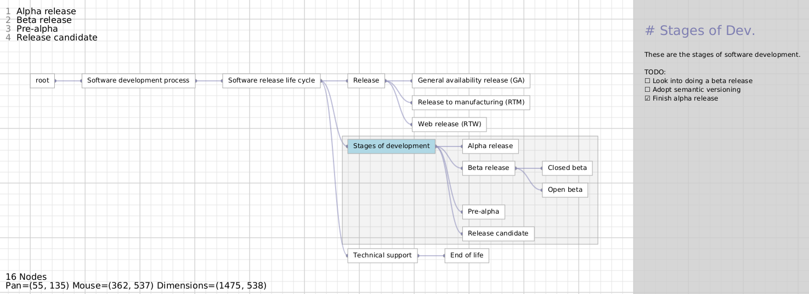
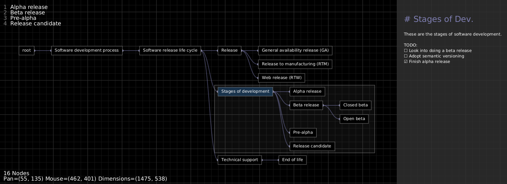

## Overview

<p align="center">
  
</p>

<p align="center">
  
</p>

The tree is a remarkably useful data structure. Trees can be used to represent
tasks, inventories, chains of responsibility, or anything else that is
fundamentally hierarchical in nature.

This program serves as a friendly interface to create, edit, and view trees.

The program is implemented in Java, built with Maven, and uses the JavaFX
library for graphics.

## Features

- Algorithm to automatically calculate the layout of the tree
- Human-readable persistant files in YAML
- Markdown preview window for node data
- Dark and light color schemes
- Persistant state to remember pan and color scheme across sessions
- Configurable editor for markdown files
- Nodes can be selected and moved around with the mouse
- Working directory is configurable by the user
- Manage multiple trees across domain areas
- Nodes can have attributes, and can be marked as "done" for TODO lists etc...

## Setup

Install the Java Runtime Environment (tested with openJDK 17).

Install Maven (tested with Maven 3.8.7).

## Usage

To run the program, use `make run`.

To build a standalone Java JAR file, use `make build`.

### Key Bindings

Use HJKL or the mouse to move around. Press `Escape` or `Q` to exit. Other key
bindings can be seen by pressing `U`.

## Dependencies

```
java
make (optional)
maven
```

## License

This work is licensed under the GNU General Public License version 3 (GPLv3).

[](https://www.gnu.org/licenses/gpl-3.0.en.html)
